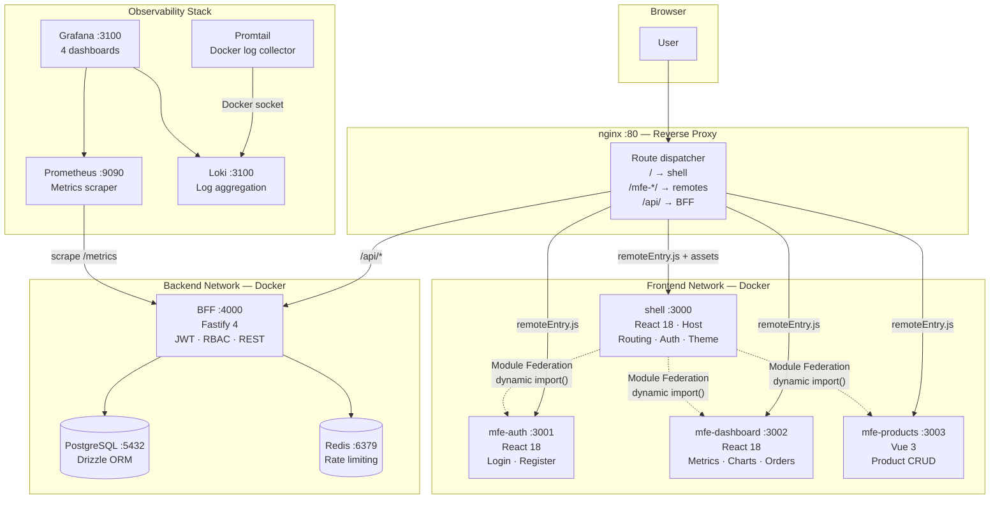
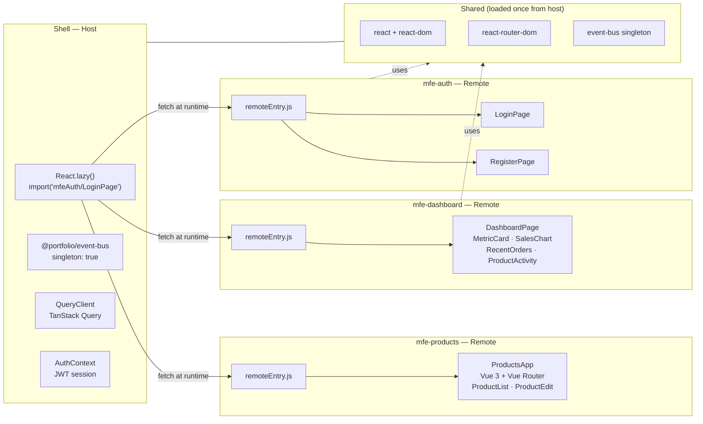
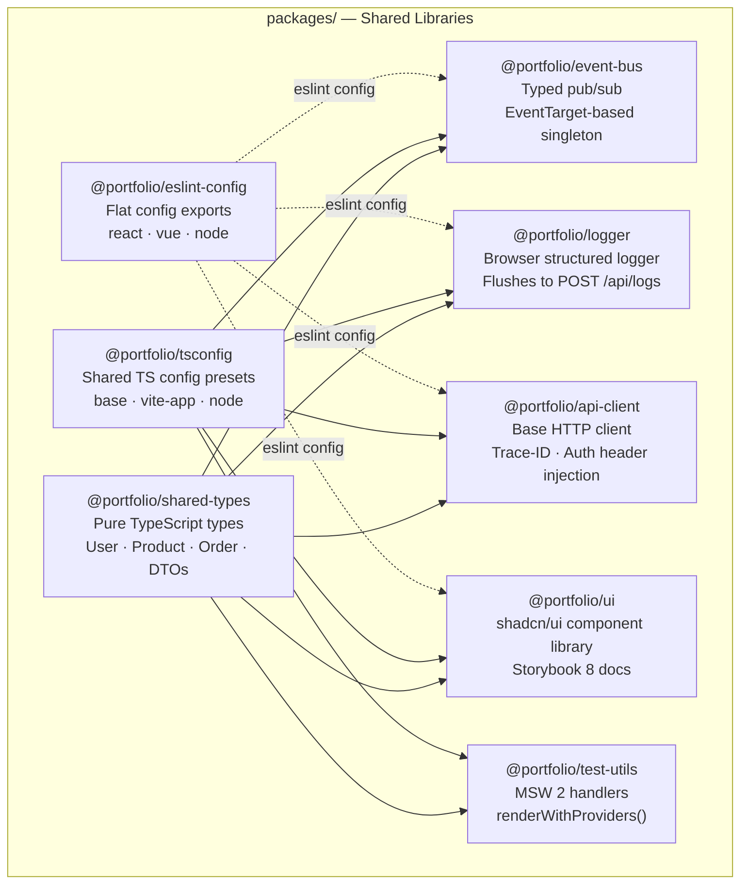
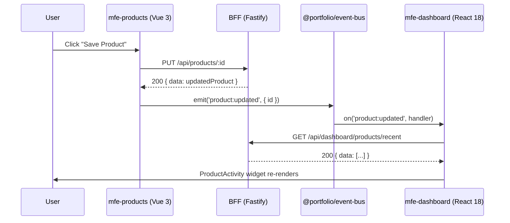
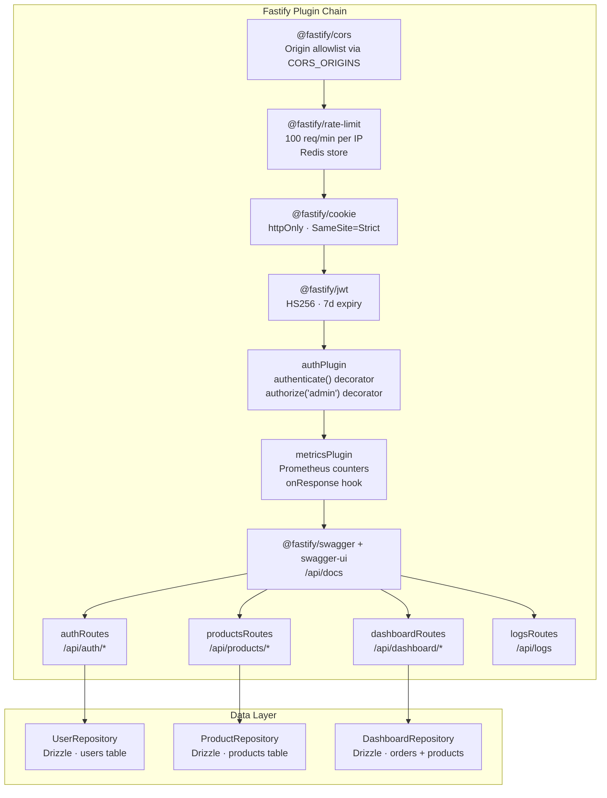
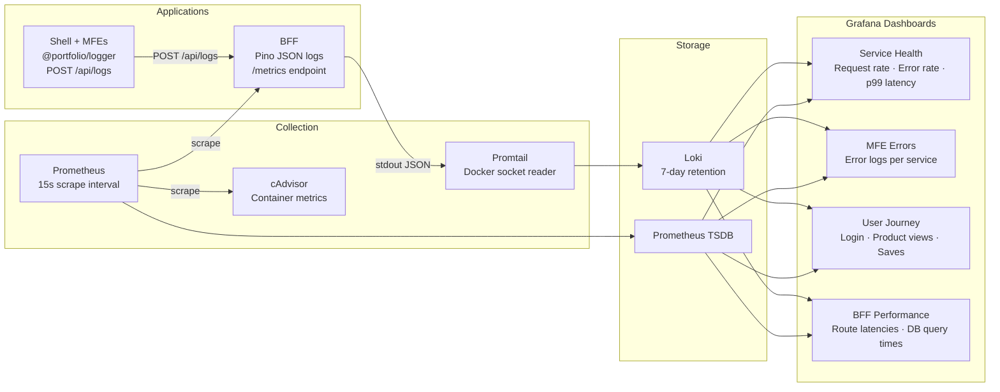
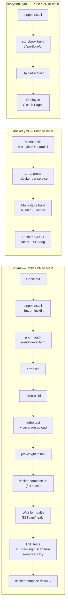
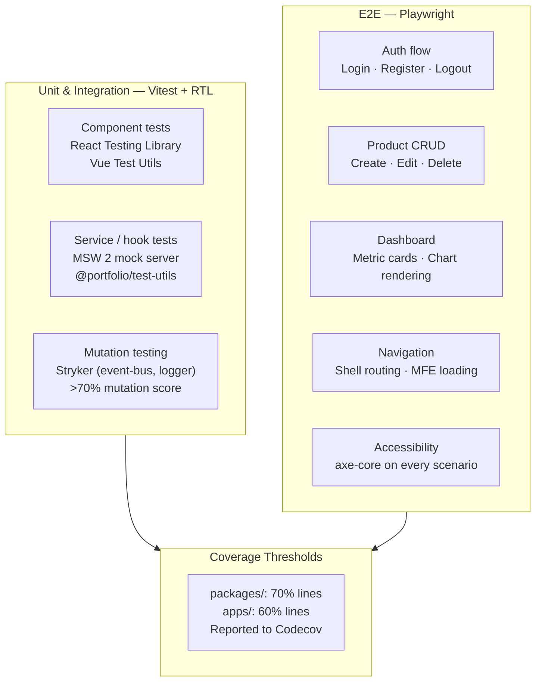

# MFE Portfolio Platform

> A production-grade e-commerce admin panel built with microfrontend architecture — demonstrating independent deployability, polyglot frontends, observability, and full-stack engineering patterns.

[](https://github.com/bwolak94/mfe-portfolio/actions/workflows/ci.yml)
[](https://codecov.io/gh/bwolak94/mfe-portfolio)
[](https://bwolak94.github.io/mfe-portfolio/)
[](https://github.com/bwolak94/mfe-portfolio/pkgs/container/mfe-portfolio-shell)
[](https://www.typescriptlang.org/)
[](https://nodejs.org/)
[](https://pnpm.io/)
[](https://turbo.build/)
[](LICENSE)

---

## Table of Contents

- [Architecture Overview](#architecture-overview)
- [Module Federation](#module-federation)
- [Tech Stack](#tech-stack)
- [Shared Packages](#shared-packages)
- [Cross-MFE Communication](#cross-mfe-communication)
- [BFF — Backend for Frontend](#bff--backend-for-frontend)
- [Observability](#observability)
- [CI/CD Pipelines](#cicd-pipelines)
- [Security](#security)
- [Testing Strategy](#testing-strategy)
- [Project Structure](#project-structure)
- [Quick Start](#quick-start)
- [Scripts](#scripts)
- [Docker](#docker)
- [Production Considerations](#production-considerations)

---

## Architecture Overview

The platform follows a **host-remote Module Federation** pattern with a monorepo managed by pnpm workspaces and Turborepo. Four independently deployable frontend applications communicate through a typed event bus and a shared BFF. All traffic enters through nginx, which acts as the single reverse proxy for both static MFE assets and API requests.



---

## Module Federation

Each MFE is an independent Vite application. The shell declares them as **remotes** and lazily imports their exposed components at runtime — no rebuild required when an MFE is redeployed.



**Key decisions:**

- `shared: { react: { singleton: true } }` — prevents duplicate React instances across MFEs
- `MFEErrorBoundary` wraps every remote; a failing MFE renders `MFEUnavailable` without crashing the shell
- In production, nginx rewrites remote URLs to relative paths (`/mfe-auth/remoteEntry.js`), eliminating CORS issues

---

## Tech Stack

### Monorepo & Tooling

| Tool                   | Version         | Role                                                                                      |
| ---------------------- | --------------- | ----------------------------------------------------------------------------------------- |
| **pnpm workspaces**    | 9+              | Package manager with strict hoisting, workspace protocol links                            |
| **Turborepo**          | 2+              | Task orchestration with remote caching — `build`, `test`, `lint`, `typecheck`             |
| **TypeScript**         | 5.4+            | Strict mode, `noUncheckedIndexedAccess`, `exactOptionalPropertyTypes` across all packages |
| **ESLint**             | 9 (flat config) | Shared config in `packages/eslint-config`; import order, a11y, react-hooks rules          |
| **Prettier**           | 3+              | Formatting enforced via lint-staged on pre-commit                                         |
| **Husky + commitlint** | —               | Conventional commits enforced on every `git commit`                                       |

### Frontend

| Technology                           | Used in                        | Purpose                                                            |
| ------------------------------------ | ------------------------------ | ------------------------------------------------------------------ |
| **React 18**                         | shell, mfe-auth, mfe-dashboard | Host app + two feature MFEs                                        |
| **Vue 3**                            | mfe-products                   | Proof of polyglot MFE — different framework, same event bus        |
| **Vite 5**                           | all MFEs                       | Fast dev server + production bundler                               |
| **@originjs/vite-plugin-federation** | all MFEs                       | Module Federation for Vite — exposes/consumes remote components    |
| **React Router 6**                   | shell                          | Shell-level routing; each route lazy-loads a remote                |
| **TanStack Query 5**                 | mfe-dashboard, mfe-products    | Server state management, cache invalidation via event bus          |
| **Tailwind CSS 3**                   | all frontends                  | Utility-first styling                                              |
| **shadcn/ui**                        | packages/ui                    | Radix UI primitives + Tailwind — accessible, composable components |
| **React Hook Form + Zod**            | mfe-auth                       | Schema-driven typed form validation                                |
| **VeeValidate + Zod**                | mfe-products                   | Vue-native form validation with same Zod schemas                   |
| **Recharts**                         | mfe-dashboard                  | Area charts for sales timeline                                     |

### Backend

| Technology                   | Version | Purpose                                                                  |
| ---------------------------- | ------- | ------------------------------------------------------------------------ |
| **Fastify 4**                | —       | BFF — high-performance HTTP, plugin architecture, JSON schema validation |
| **Drizzle ORM**              | —       | Type-safe SQL builder; migrations via `drizzle-kit`                      |
| **PostgreSQL**               | 16      | Primary data store                                                       |
| **Redis**                    | 7       | Rate-limit store for `@fastify/rate-limit`                               |
| **bcryptjs**                 | —       | Password hashing (cost factor 12)                                        |
| **@fastify/jwt**             | —       | JWT signed with HS256, stored in `httpOnly; SameSite=Strict` cookie      |
| **prom-client**              | —       | Prometheus `/metrics` endpoint — request counts, durations, error rates  |
| **Pino**                     | —       | Structured JSON logging; Promtail forwards logs to Loki                  |
| **Zod + zod-to-json-schema** | —       | Input validation at every route boundary; generates Fastify JSON schemas |

### Observability

| Component      | Role                                                              |
| -------------- | ----------------------------------------------------------------- |
| **Prometheus** | Scrapes `bff:4000/metrics` every 15s                              |
| **Loki**       | Log aggregation with 7-day retention                              |
| **Promtail**   | Reads Docker container logs via Docker socket → pushes to Loki    |
| **Grafana**    | 4 provisioned dashboards (auto-loaded from `grafana/dashboards/`) |
| **cAdvisor**   | Container resource metrics (CPU, memory, network) → Prometheus    |

---

## Shared Packages



| Package                   | Description                                                                                                                                                                                  |
| ------------------------- | -------------------------------------------------------------------------------------------------------------------------------------------------------------------------------------------- |
| `@portfolio/shared-types` | Pure TypeScript — no runtime code. Domain types (`User`, `Product`, `Order`) and API DTOs (`LoginRequest`, `PaginatedResponse<T>`) shared between BFF and all frontends                      |
| `@portfolio/event-bus`    | Zero-dependency typed pub/sub wrapper over native `EventTarget`. Enforced as Module Federation singleton — one instance across all MFEs                                                      |
| `@portfolio/logger`       | Browser-side structured logger. Buffers entries in memory, flushes to `POST /api/logs` every 2s or when 10 entries accumulate. Fields: `service`, `level`, `message`, `traceId`, `timestamp` |
| `@portfolio/api-client`   | Base HTTP client factory with `Authorization` header injection, `x-trace-id` propagation, and typed `ApiRequestError`                                                                        |
| `@portfolio/ui`           | shadcn/ui components (Button, Card, Badge, Input, Spinner) — Storybook 8 hosted on GitHub Pages                                                                                              |
| `@portfolio/test-utils`   | MSW 2 handlers for all API routes, `setupServer()` helper, `renderWithProviders()` (QueryClient + MemoryRouter), shared mock fixtures                                                        |

---

## Cross-MFE Communication

Three communication patterns are used, in order of preference:



| Pattern                    | When to use                      | Example                                             |
| -------------------------- | -------------------------------- | --------------------------------------------------- |
| **URL / Router state**     | Navigation, bookmarkable state   | Shell routes to `/products/:id`                     |
| **`@portfolio/event-bus`** | Cross-MFE side-effects           | `product:updated` invalidates dashboard query cache |
| **Auth context (Shell)**   | Session state needed by all MFEs | `useAuth()` hook reads Shell's `AuthContext`        |

---

## BFF — Backend for Frontend

The BFF aggregates data for the frontend, handles authentication, and enforces RBAC. It is the only service with database access — frontends never talk to PostgreSQL or Redis directly.



### Auth Flow

```
POST /api/auth/login
  → Zod validates body
  → UserRepository.findByEmail()
  → bcrypt.compare(password, hash)
  → fastify.jwt.sign({ sub, role })
  → reply.setCookie('token', jwt, { httpOnly, sameSite: 'Strict' })
  → 200 { data: { user } }

Protected route (e.g. PUT /api/products/:id)
  → fastify.authenticate    — verifies JWT from cookie → attaches request.user
  → fastify.authorize('admin') — checks user.role → 403 if viewer
  → Zod validates params + body
  → ProductRepository.update()
  → 200 { data: updatedProduct }
```

---

## Observability



All Grafana datasources and dashboards are provisioned automatically from `grafana/provisioning/` — no manual setup required after `docker compose up`.

---

## CI/CD Pipelines



| Workflow                        | Trigger            | Steps                                              |
| ------------------------------- | ------------------ | -------------------------------------------------- |
| **CI** (`ci.yml`)               | Push / PR → `main` | Audit → Lint → Build → Unit tests → Coverage → E2E |
| **Docker** (`docker.yml`)       | Push → `main`      | 5-service matrix build → push to GHCR              |
| **Storybook** (`storybook.yml`) | Push / PR → `main` | Build → GitHub Pages deploy                        |

### Required Secrets

| Secret          | Purpose                               |
| --------------- | ------------------------------------- |
| `TURBO_TOKEN`   | Turborepo remote cache authentication |
| `TURBO_TEAM`    | Turborepo remote cache team slug      |
| `CODECOV_TOKEN` | Upload coverage reports to Codecov    |

`GITHUB_TOKEN` is injected automatically for GHCR login.

---

## Security

Security controls are mapped to OWASP Top 10 (2021). Full details in [`docs/security.md`](./docs/security.md).

| OWASP Category                    | Controls                                                                                         |
| --------------------------------- | ------------------------------------------------------------------------------------------------ |
| **A01 Broken Access Control**     | RBAC via `authorize('admin')` decorator; JWT in `httpOnly` cookie; `ProtectedRoute` in shell     |
| **A02 Cryptographic Failures**    | bcrypt (cost 12) for passwords; HS256 JWT with 32+ char secret; `Secure` cookie flag             |
| **A03 Injection**                 | Drizzle ORM parameterised queries; Zod validation at every route boundary                        |
| **A04 Insecure Design**           | BFF layer — frontends have no DB access; principle of least privilege via viewer role            |
| **A05 Security Misconfiguration** | nginx security headers (CSP, X-Frame-Options, nosniff); explicit CORS allowlist                  |
| **A06 Vulnerable Components**     | `pnpm audit --audit-level high` in CI; Renovate auto-merges patch/minor deps                     |
| **A07 Auth Failures**             | `@fastify/rate-limit` 100 req/min; JWT 7d expiry; `/api/auth/me` re-validates on load            |
| **A08 Software Integrity**        | `pnpm-lock.yaml` committed; `--frozen-lockfile` in CI and Docker; Turborepo content-hashed cache |
| **A09 Logging & Monitoring**      | Pino structured logs → Loki; Prometheus `auth_login_errors_total` counter; Grafana alerting      |
| **A10 SSRF**                      | BFF makes no outbound requests to user-supplied URLs                                             |

---

## Testing Strategy



| Layer              | Tool                                            | Scope                                                        |
| ------------------ | ----------------------------------------------- | ------------------------------------------------------------ |
| Unit / integration | Vitest + React Testing Library / Vue Test Utils | Components, hooks, services, repositories                    |
| API mocking        | MSW 2 (browser + Node)                          | All BFF endpoints mocked via `@portfolio/test-utils`         |
| E2E                | Playwright                                      | 20 scenarios across 5 user journeys; Chromium in CI          |
| Accessibility      | axe-core/playwright                             | WCAG 2.1 AA checked on every E2E scenario                    |
| Mutation           | Stryker + vitest-runner                         | `event-bus` and `logger` packages; catches undertested logic |
| Coverage           | Vitest v8                                       | 70% packages / 60% apps; uploaded to Codecov                 |

---

## Project Structure

```
mfe-portfolio/
├── apps/
│   ├── shell/                  # React 18 host — routing, auth, theme, MFE loading
│   ├── mfe-auth/               # React 18 remote — login, register
│   ├── mfe-dashboard/          # React 18 remote — metrics, sales chart, orders
│   ├── mfe-products/           # Vue 3 remote — product list and edit CRUD
│   └── bff/                    # Fastify 4 BFF — REST API, JWT auth, RBAC
│       ├── src/
│       │   ├── domain/         # Drizzle schema, seed data
│       │   ├── plugins/        # auth, metrics Fastify plugins
│       │   ├── routes/         # auth, products, dashboard, logs
│       │   ├── services/       # AuthService, ProductService, DashboardService
│       │   └── repositories/   # UserRepository, ProductRepository, DashboardRepository
│       └── drizzle.config.ts
├── packages/
│   ├── ui/                     # shadcn/ui design system + Storybook 8
│   ├── shared-types/           # Shared TypeScript types (no runtime code)
│   ├── event-bus/              # Typed EventTarget pub/sub singleton
│   ├── logger/                 # Browser structured logger → BFF
│   ├── api-client/             # Base HTTP client + interceptors
│   ├── test-utils/             # MSW handlers, renderWithProviders, fixtures
│   ├── tsconfig/               # Shared TS config presets (base, vite-app, node)
│   └── eslint-config/          # Shared ESLint 9 flat configs
├── docs/
│   ├── adr/                    # Architecture Decision Records (ADR 001–008)
│   ├── architecture.md         # Full system narrative
│   ├── runbook.md              # Debugging common issues
│   └── security.md             # OWASP Top 10 mapping
├── e2e/                        # Playwright specs (inside apps/shell)
├── .github/
│   └── workflows/              # ci.yml, docker.yml, storybook.yml
├── turbo.json                  # Task graph: build → test → lint → typecheck
├── pnpm-workspace.yaml
├── docker-compose.yml          # Full stack (all services + observability)
├── docker-compose.dev.yml      # Infra only (postgres, redis, grafana stack)
├── docker-compose.minimal.yml  # Shell + BFF + DB only
└── nginx/nginx.conf            # Reverse proxy + security headers
```

---

## Quick Start

### Prerequisites

- Node.js 20 LTS
- pnpm 9+
- Docker + Docker Compose (for full stack)

### Development (all services)

```bash
# Install dependencies
pnpm install

# Start all apps in watch mode (each on its own port)
pnpm dev
```

| App           | URL                            |
| ------------- | ------------------------------ |
| Shell         | http://localhost:3000          |
| MFE Auth      | http://localhost:3001          |
| MFE Dashboard | http://localhost:3002          |
| MFE Products  | http://localhost:3003          |
| BFF API       | http://localhost:4000          |
| Swagger UI    | http://localhost:4000/api/docs |

> All MFE dev servers must be running simultaneously for the shell to compose them correctly.

### Full Stack with Docker

```bash
# Start everything — nginx + all MFEs + BFF + postgres + redis + grafana stack
docker compose up --build

# Infra only (DB + observability), MFEs run via pnpm dev
docker compose -f docker-compose.dev.yml up
```

| Service     | URL                   |
| ----------- | --------------------- |
| App (nginx) | http://localhost      |
| Grafana     | http://localhost:3100 |
| Prometheus  | http://localhost:9090 |

### Default credentials

```
Admin:  admin@example.com / password123
Viewer: viewer@example.com / password123
```

---

## Scripts

```bash
# Monorepo (root)
pnpm dev             # Start all apps in watch mode (Turborepo parallel)
pnpm build           # Build all packages and apps (cached)
pnpm test            # Run all unit + integration tests
pnpm lint            # Lint all packages (ESLint 9 flat config)
pnpm lint:fix        # Auto-fix lint issues
pnpm typecheck       # TypeScript check across the full monorepo
pnpm format          # Prettier — format all files
pnpm clean           # Remove dist/, .turbo/, coverage/ everywhere

# Single package
pnpm --filter @portfolio/bff dev
pnpm --filter @portfolio/mfe-dashboard test:watch
pnpm --filter @portfolio/ui storybook

# Database (BFF)
pnpm --filter @portfolio/bff db:generate   # Generate Drizzle migrations
pnpm --filter @portfolio/bff db:migrate    # Apply migrations
pnpm --filter @portfolio/bff db:seed       # Seed demo data
pnpm --filter @portfolio/bff db:studio     # Drizzle Studio UI
```

---

## Docker

All images use **multi-stage builds** with `turbo prune --docker` to create a minimal, pruned workspace per service. Final images run as non-root users.

```
builder stage  — full Node 20 + pnpm, installs deps, builds artifact
runner stage   — Node 20 Alpine, copies only the built output + prod deps
```

Images are published to GHCR on every push to `main`:

```bash
# Pull and run the shell
docker pull ghcr.io/bwolak94/mfe-portfolio-shell:latest

# Run with environment overrides
JWT_SECRET=your-secret-min-32-chars docker compose up
```

### Environment Variables (BFF)

| Variable        | Default                 | Required                           |
| --------------- | ----------------------- | ---------------------------------- |
| `DATABASE_URL`  | —                       | Yes                                |
| `JWT_SECRET`    | —                       | Yes (min 32 chars)                 |
| `REDIS_URL`     | `redis://redis:6379`    | No                                 |
| `CORS_ORIGINS`  | `http://localhost:3000` | No                                 |
| `COOKIE_SECURE` | `false`                 | No (`true` in production with TLS) |
| `NODE_ENV`      | `development`           | No                                 |

---

## Architecture Decision Records

Key design decisions are documented as ADRs in [`docs/adr/`](./docs/adr/):

| ADR                                              | Decision                                                     |
| ------------------------------------------------ | ------------------------------------------------------------ |
| [001](./docs/adr/001-module-federation.md)       | Use Module Federation for runtime MFE composition            |
| [002](./docs/adr/002-monorepo-tooling.md)        | pnpm workspaces + Turborepo over Nx or Lerna                 |
| [003](./docs/adr/003-vite-over-webpack.md)       | Vite 5 as the bundler for all MFEs                           |
| [004](./docs/adr/004-polyglot-mfe-react-vue.md)  | Vue 3 for mfe-products to prove framework agnosticism        |
| [005](./docs/adr/005-typescript-strict-mode.md)  | TypeScript strict mode + noUncheckedIndexedAccess everywhere |
| [006](./docs/adr/006-fastify-over-express.md)    | Fastify 4 over Express for the BFF                           |
| [007](./docs/adr/007-loki-over-elk.md)           | Loki + Promtail over ELK for log aggregation                 |
| [008](./docs/adr/008-event-bus-communication.md) | EventTarget-based typed event bus over a shared store        |

---

## Production Considerations

This is a portfolio project. A production deployment would add:

| Area                     | What to add                                                                                        |
| ------------------------ | -------------------------------------------------------------------------------------------------- |
| **Orchestration**        | Kubernetes — one `Deployment` per MFE, HPA autoscaling, health probes                              |
| **MFE versioning**       | CDN-hosted `remoteEntry.js` with version manifest; shell reads manifest at boot for canary deploys |
| **Identity**             | Dedicated IdP (Keycloak / Auth0) — OIDC, MFA, token revocation lists                               |
| **Service mesh**         | Linkerd — mTLS between MFE containers and BFF, automatic retries                                   |
| **Feature flags**        | Unleash — independent MFE feature gating without a shell redeploy                                  |
| **Error tracking**       | Sentry — source-mapped frontend errors, performance tracing                                        |
| **APM**                  | Datadog — distributed traces across nginx → BFF → DB                                               |
| **Synthetic monitoring** | Checkly — proactive alerting on critical user journeys                                             |
| **DB**                   | Connection pooling (PgBouncer), read replicas, automated backups                                   |

---

## Contributing

This is a portfolio project. Issues and discussions are welcome via [GitHub Issues](https://github.com/bwolak94/mfe-portfolio/issues).

---

## License

MIT
